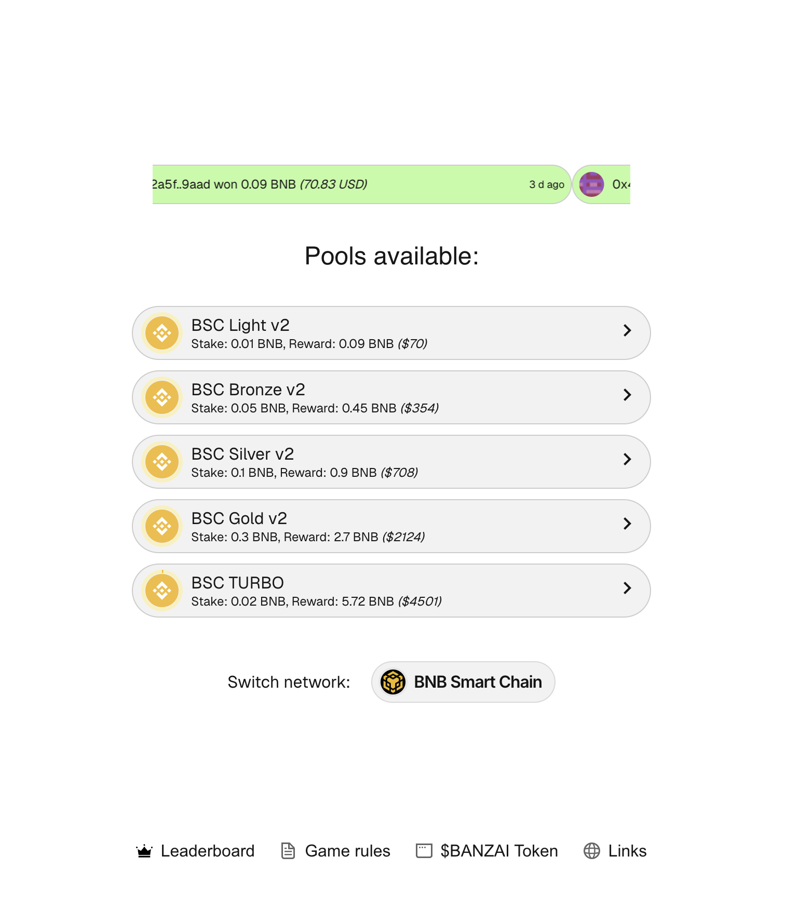
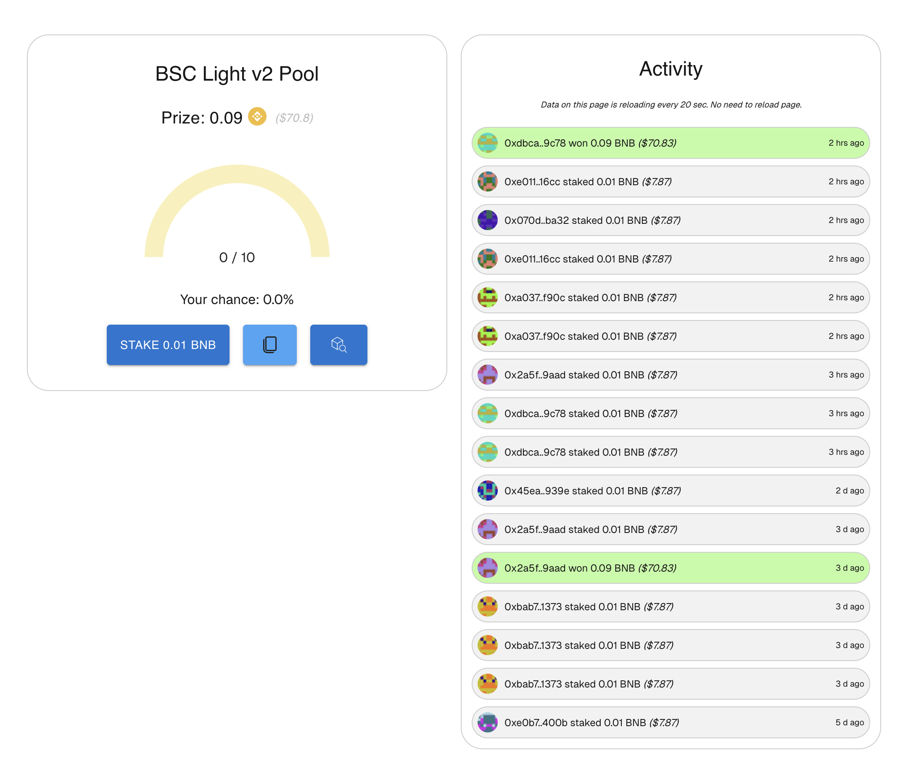

This is a [Banzai GameFi](https://banzai.meme) new dApp, created using Next.js, AppKit, Wagmi.

## Getting Started

First, run the development server:

```bash
npm install
npm run dev

```

Open [http://localhost:3000](http://localhost:3000) with your browser to see the result.

## Pools list


## Pool page

